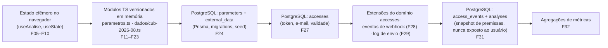

# Mapa de Fases — Terreno Viável

Mapa orientativo auxiliar ao [`plan.md`](./plan.md). Reúne, em formato visual e tabular, como as 34 fases (F00–F33) se relacionam, onde cada dado vive, o que prova objetivamente que uma fase está tecnicamente pronta e qual parte do stack cada fase toca.

## Como ler este mapa

- **Não substitui o `plan.md`.** Os 27 campos de cada fase (escopo, testes, riscos, decisões, checkpoint de UX etc.) continuam sendo a referência de execução. Este arquivo é um índice de consulta rápida antes de entrar em uma fase.
- **Fonte de verdade continua sendo `PRD.md` e `CLAUDE.md`.** Todo dado aqui foi extraído do `plan.md` já aprovado — nenhuma regra, tabela ou coeficiente novo foi criado.
- **Critério objetivo ≠ aprovação de UX.** Como no `plan.md`, passar nos testes de uma fase é condição necessária, nunca suficiente, para avançar.
- **Manutenção:** atualize este arquivo no mesmo commit em que o status de uma fase muda no `plan.md` (ex.: ao marcar `[x] Aprovada`), para os dois documentos nunca divergirem.

---

## 1. Fluxo de dependências entre as 34 fases

Cadeia real de dependências (campo "12. Dependências" de cada fase no `plan.md`) — é linear por fase, por desenho: cada fase só começa com a anterior aprovada. As cores indicam a camada de stack predominante (ver seção 5).

```mermaid
flowchart TD
    classDef fe fill:#DBE8FE,stroke:#1A52D6,color:#0A1A2F
    classDef femotor fill:#BED4FD,stroke:#1A52D6,color:#0A1A2F
    classDef febemotor fill:#5F93F7,stroke:#163FA8,color:#ffffff
    classDef banco fill:#12876A,stroke:#0A1A2F,color:#ffffff
    classDef comercial fill:#C2760A,stroke:#0A1A2F,color:#ffffff

    subgraph M1["MACROETAPA 1 — Construção e validação do produto"]
        direction TB
        F00["F00 · Fundação e design system"]:::fe --> F01["F01 · Shell e navegação"]:::fe
        F01 --> F02["F02 · Página inicial"]:::fe
        F02 --> F03["F03 · Onboarding v1"]:::fe
        F03 --> F04["F04 · Onboarding v2"]:::fe
        F04 --> F05["F05 · Estrutura Terreno"]:::fe
        F05 --> F06["F06 · Localização + CEP"]:::febemotor
        F06 --> F07["F07 · Dados físico-financeiros"]:::femotor
        F07 --> F08["F08 · Formato e topografia"]:::fe
        F08 --> F09["F09 · Tipo/tipologia/padrão"]:::femotor
        F09 --> F10["F10 · Pavimentos e unidades"]:::femotor
        F10 --> F11["F11 · Áreas e indicadores"]:::femotor
        F11 --> F12["F12 · Parâmetros e CUB"]:::femotor
        F12 --> F13["F13 · Motor econômico e API"]:::febemotor
        F13 --> F14["F14 · Resultado v1"]:::fe
        F14 --> F15["F15 · Composição econômica"]:::fe
        F15 --> F16["F16 · Toggle perspectiva"]:::febemotor
        F16 --> F17["F17 · Premissas ajustáveis"]:::febemotor
        F17 --> F18["F18 · Alertas"]:::febemotor
        F18 --> F19["F19 · LASTRO Score"]:::febemotor
        F19 --> F20["F20 · Exportação PDF"]:::febemotor
        F20 --> F21["F21 · Exportação HTML"]:::febemotor
        F21 --> F22["F22 · Limpar análise"]:::fe
        F22 --> F23["F23 · Varredura de qualidade"]:::fe
        F23 --> F24["F24 · Persistência CUB/parâmetros"]:::banco
    end

    subgraph M2["MACROETAPA 2 — Aquisição, pagamento e acesso"]
        direction TB
        F25["F25 · Funil de vendas"]:::comercial --> F26["F26 · Checkout Kiwify"]:::comercial
        F26 --> F27["F27 · Link de acesso"]:::comercial
        F27 --> F28["F28 · Webhook idempotente"]:::comercial
        F28 --> F29["F29 · E-mail Resend"]:::comercial
        F29 --> F30["F30 · Recuperação/revogação"]:::comercial
        F30 --> F31["F31 · Registro interno"]:::banco
        F31 --> F32["F32 · Métricas"]:::comercial
        F32 --> F33["F33 · Endurecimento"]:::comercial
    end

    F24 --> F25
```

---

## 2. Linha do tempo dos dados

Cada dado do produto muda de "casa" ao longo das fases: nasce como estado efêmero no navegador, vira módulo TS versionado (para não ter número mágico antes de existir banco), e só depois migra para PostgreSQL.

> `eventosCompraRepo` (F28) e o log de envio de e-mail (F29) **não são tabelas novas fora das 5 definidas no `CLAUDE.md`** — são extensões dentro do domínio `accesses` (rastreiam o ciclo de vida do mesmo acesso emitido).

### Tabela × Fases

| Tabela (`CLAUDE.md` 6.1) | Fase que cria o schema | Fases que escrevem | Fases que leem | O que armazena | Restrição do PRD |
|---|---|---|---|---|---|
| `parameters` | F24 | F24 (seed/import) | F13, F17–F19 (via repositório, a partir da F24) | Percentuais de terreno/lucro, aditivos, composição de despesas gerais, taxa de ocupação, faixas de alerta — versionados | 2.10 — sem números mágicos; snapshot no exportado e no registro interno |
| `external_data` | F24 | F24 (importação admin, D-B12) | F12/F13 (via repositório, a partir da F24) | Versões do CUB Sinduscon-MG: competência, data de emissão, origem, valores | 3.4 — nunca sobrescreve; fallback para última versão válida; alerta de desatualização |
| `accesses` | F27 | F27 (emissão), F28 (webhook), F30 (revogação/recuperação) | F27 (middleware), F26, F30 | E-mail, token (hash), validade, estado (ativo/expirado/revogado) | 2.7, 6.3 — token de alta entropia; só o e-mail da compra acessa; sem JWT/bcrypt de usuário |
| `access_events` | F31 | F31 (instrumentação de uso) | F32 (métricas) | Abertura do link, tempo de permanência | 2.7 — não vira histórico nem é exposto ao usuário |
| `analyses` | F31 | F13/F17 (gravação via F31) | F31 (admin), F32 (métricas) | Resultado gerado + snapshot de premissas e versão de dados | 2.7, 10.5 — armazenamento interno, nunca devolvido ao usuário; base para auditoria |

---

## 3. Critérios objetivos de conclusão por fase

Uma linha por fase, condensada dos campos 15 e 26 do `plan.md`. Para o detalhe completo (testes, estados, riscos), consulte a fase correspondente lá.

| Fase | Critério técnico objetivo | Teste que comprova |
|---|---|---|
| F00 | App sobe (front+back); tema persiste; `/api/v1/saude` responde | `useTema.test`, lint de tokens |
| F01 | 5 rotas respondem; navegação preserva tema; 404 funciona | Testes de componente/rota |
| F02 | 1º acesso → onboarding; acessos seguintes → formulário | `usePrimeiroAcesso.test` |
| F03 | Todos os passos acessíveis; "Pular" leva ao formulário | Teste de navegação |
| F04 | Reabrir do cabeçalho não limpa o formulário em preenchimento | Teste de estado preservado |
| F05 | Validação bloqueia "Avançar"; estado sobrevive à navegação | Teste de validação + `useAnalise` |
| F06 | Autopreenchimento funciona; falha da API não bloqueia | `useCep.test` (4 cenários) |
| F07 | R$/m² = preço ÷ área, com arredondamento testado | Testes de arredondamento monetário |
| F08 | As 4 topografias e 2 formatos batem com o PRD 3.2; Etapa 1 conclui | Teste de seleção + conclusão de etapa |
| F09 | Combinações de taxonomia idênticas ao PRD 3.1; nenhuma inventada | Teste de taxonomia em cascata |
| F10 | Restrição casa/galpão aplicada; total de unidades e preço/m² corretos | Testes de regra por tipologia |
| F11 | As 4 fórmulas de área batem com o exemplo de referência do PRD | `areas.test.ts` |
| F12 | CUB Ajustado reproduz R$ 3.154,91/m² do exemplo; lacunas retornam pendência, nunca valor | `cub.test.ts` |
| F13 | Motor reproduz o cenário de referência; API valida no backend; < 500ms | `economia.test.ts` + teste de integração |
| F14 | Preço máximo recomendado = Resultado Terreno (perspectiva Terrenista) | Teste de componente |
| F15 | Linhas e percentuais da composição batem com o PRD 2.5 | Teste de cálculo de percentuais |
| F16 | As duas perspectivas usam a mesma base; margem resultante confere | Teste de consistência Terrenista/Incorporador |
| F17 | Recalcula < 500ms; ajuste não altera padrão global | Teste de sobreposição de premissas |
| F18 | Faixas exatas (40–65%, 10–15%, 80–85%); nenhum alerta bloqueia | Testes de limite por faixa |
| F19 | Score sempre em [0,100]; decisão bate com os limiares 50/70 | Testes de fronteira do score |
| F20 | PDF contém todas as seções do PRD 2.5 + snapshot; < 3s | Teste de geração + medição de tempo |
| F21 | HTML idêntico ao PDF em conteúdo; sem dado sensível embutido | Teste de conteúdo/escapamento |
| F22 | Confirmar limpa tudo; cancelar preserva; aviso some se já exportou | Teste do modal + limpeza de estado |
| F23 | Fluxo completo passa; sem erro de console; três larguras cobertas | `fluxo-completo.test.tsx` |
| F24 | Cálculo idêntico ao da F19, agora servido pelo banco; fallback funciona | Teste de repositório + comparação pré/pós migração |
| F25 | Landing pública funciona sem acesso; `/app` isolado | Teste de rota pública × protegida |
| F26 | Retorno identifica a compra; nenhum segredo no frontend | Teste dos estados de confirmação |
| F27 | 4 estados de token tratados; validação só no servidor | Testes de token (válido/expirado/revogado/ausente) |
| F28 | Reenvio do mesmo evento não duplica acesso; assinatura inválida rejeita | Teste de idempotência e de assinatura |
| F29 | E-mail chega com link funcional; falha é registrada e reprocessável | Teste de envio + retentativa |
| F30 | Recuperação só ao e-mail registrado; revogação tem efeito imediato | Teste de enumeração impossível + revogação |
| F31 | Snapshot completo gravado; nenhum endpoint do usuário expõe dado interno | Teste de gravação + teste de não-exposição |
| F32 | Cada métrica do PRD 9 calculada com fórmula documentada | Teste de cálculo com dados sintéticos |
| F33 | Checklist de segurança 100% cumprido; nenhum segredo no bundle | Testes de cabeçalhos, rate limit, varredura de segredos |

---

## 4. Atuação do stack por fase

`✓` = a fase toca essa camada · `—` = não toca

| Fase | Frontend (React/TS) | Backend (Express) | Motor puro (`utils/motor`) | PostgreSQL/Prisma | Integração externa |
|---|:---:|:---:|:---:|:---:|:---:|
| F00 | ✓ | ✓ (saúde) | — | — | — |
| F01 | ✓ | — | — | — | — |
| F02 | ✓ | — | — | — | — |
| F03 | ✓ | — | — | — | — |
| F04 | ✓ | — | — | — | — |
| F05 | ✓ | — | — | — | — |
| F06 | ✓ | ✓ (proxy CEP) | — | — | ✓ ViaCEP |
| F07 | ✓ | — | ✓ (formatação) | — | — |
| F08 | ✓ | — | — | — | — |
| F09 | ✓ | — | ✓ (taxonomia) | — | — |
| F10 | ✓ | — | ✓ (regras de programa) | — | — |
| F11 | ✓ | — | ✓ (`areas.ts`) | — | — |
| F12 | ✓ | — | ✓ (`cub.ts`) | — | — |
| F13 | ✓ | ✓ (rota/controller) | ✓ (`economia.ts`) | — | — |
| F14 | ✓ | — | — | — | — |
| F15 | ✓ | — | — | — | — |
| F16 | ✓ | ✓ | ✓ (`economia.ts`) | — | — |
| F17 | ✓ | ✓ | ✓ (`premissas.ts`) | — | — |
| F18 | ✓ | — | ✓ (`kpis.ts`, `alertas.ts`) | — | — |
| F19 | ✓ | ✓ | ✓ (`score.ts`) | — | — |
| F20 | ✓ | — | — | — | ✓ lib de PDF (D-B9) |
| F21 | ✓ | ✓* | — | — | — |
| F22 | ✓ | — | — | — | — |
| F23 | ✓ | — | — | — | — |
| F24 | ✓ (tela admin) | ✓ | ✓ (injeção de dados) | ✓ | — |
| F25 | ✓ | — | — | — | — |
| F26 | ✓ | ✓ | — | — | ✓ Kiwify (checkout) |
| F27 | ✓ (guarda de rota) | ✓ (middleware) | — | ✓ (`accesses`) | — |
| F28 | ✓ (admin) | ✓ | — | ✓ (`accesses`) | ✓ Kiwify (webhook) |
| F29 | — | ✓ | — | ✓ (log de envio) | ✓ Resend |
| F30 | ✓ | ✓ | — | ✓ (`accesses`) | ✓ Resend |
| F31 | — | ✓ | — | ✓ (`analyses`, `access_events`) | — |
| F32 | ✓ (admin) | ✓ | — | ✓ (leitura agregada) | — |
| F33 | ✓ (revisão) | ✓ | — | — | — |

\* F21 só usa backend se D-B10 optar por link hospedado (em vez de arquivo baixado).

---

## 5. Legenda

**Cores do fluxo (seção 1) / categorias de stack:**

| Cor | Categoria | Significado |
|---|---|---|
| 🔵 claro (`#DBE8FE`) | **FE** | Só frontend — UI, navegação, conteúdo |
| 🔵 médio (`#BED4FD`) | **FE+Motor** | Frontend + motor puro (`utils/motor`), sem chamada ao Express |
| 🔵 forte (`#5F93F7`) | **FE+BE+Motor** | Frontend + API Express + motor puro |
| 🟢 (`#12876A`) | **+Banco** | Acrescenta PostgreSQL/Prisma |
| 🟠 (`#C2760A`) | **Comercial/Segurança** | Fases da Macroetapa 2 — checkout, webhook, token, e-mail, LGPD |

**Símbolos das tabelas:** `✓` toca a camada · `—` não toca · `*` condicional a uma decisão bloqueante (ver `plan.md`, seção "Decisões necessárias").

---

*Gerado a partir do `plan.md` aprovado. Atualize este arquivo junto com o status de cada fase.*
